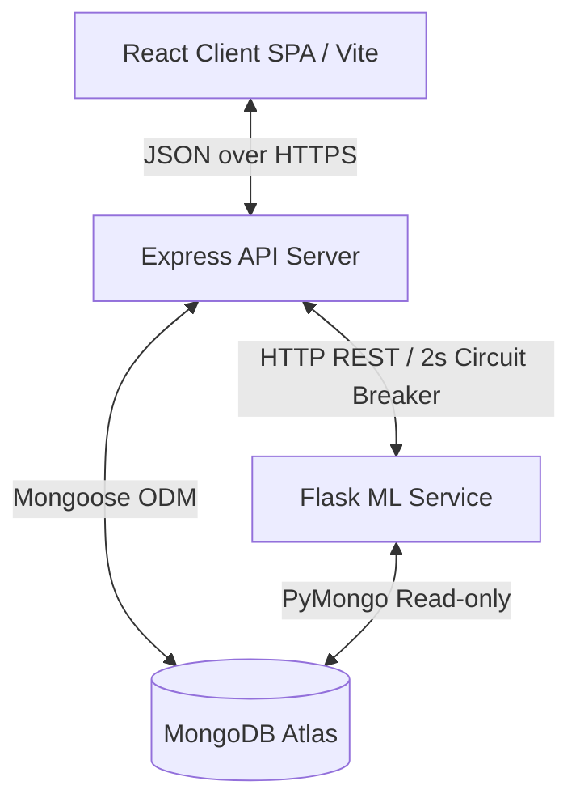
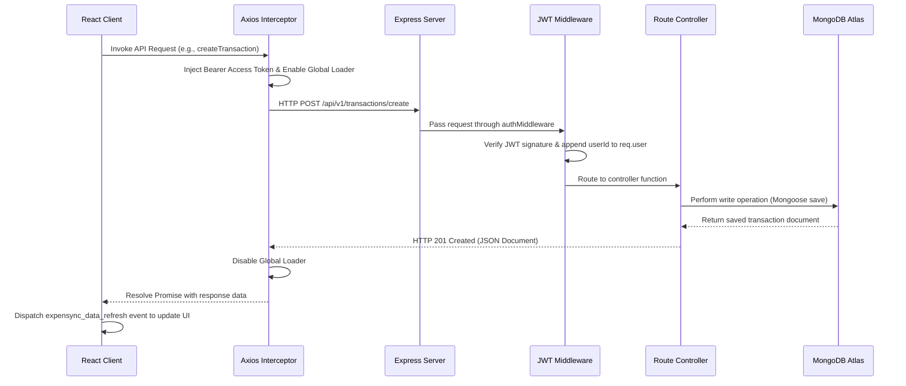
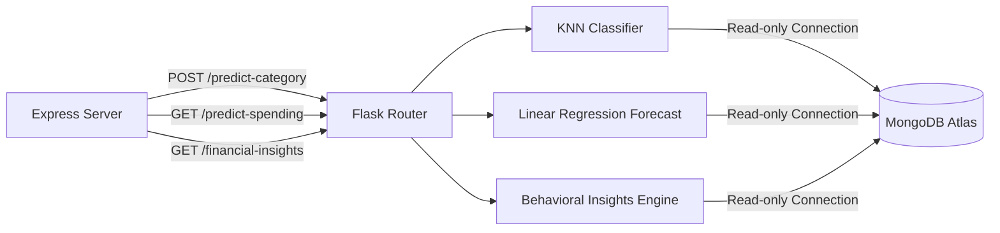

# 📊 Expensync Technical Architecture & System Design Documentation

This document describes the high-level system design, subsystem architectures, communication pathways, database schemas, and production readiness mechanisms implemented in **Expensync**.

---

## 1. High-Level System Architecture

Expensync is structured as a decoupled, multi-tier system composed of a single-page frontend client, an API gateway server, a dedicated Machine Learning forecasting microservice, and a cloud-hosted document store database.



### Core Architecture Components
1.  **Presentation Tier (Frontend)**: React SPA optimized with Vite, Tailwind CSS, and Chart.js. Communicates asynchronously with the backend server via a centralized HTTP client.
2.  **Application Tier (Backend API)**: Node.js and Express server hosting REST endpoints, managing route permissions, parsing receipts via OCR, and serving as the data orchestrator.
3.  **Analytical Tier (ML Service)**: Python Flask microservice handling algorithmic modeling, KNN transaction classification, and Linear Regression forecasting.
4.  **Persistence Tier (Data Store)**: MongoDB Atlas cluster housing structured documents mapping users, ledger transactions, custom merchant rules, and budget limits.

---

## 2. Frontend Subsystem Architecture

The client application is built on React 18, leveraging the Virtual DOM to manage modular components.

### Directory Structure & Module Distribution
*   **`src/api/api.js`**: Centralized Axios client containing request/response interceptors to manage token validation, injection, and global loading state.
*   **`src/components/`**: Reusable component catalog (e.g. `Dashboard`, `AddTransaction`, `Charts`, `Layout`, `Navbar`, `ReceiptDropzone`, `SmartInputBar`).
*   **`src/context/`**: State contexts providing styling theme parameters (`ThemeContext.jsx`) and global blocker spinners (`LoaderContext.jsx`).
*   **`src/pages/`**: Primary viewport controllers (`Home`, `Landing`, `Login`, `Signup`).
*   **`src/utils/`**: Shared tools (e.g., `toast.js` wrapping `react-toastify`, `loaderControl.js` to trigger load indicators outside standard React life cycles).

### State Management & Communication
*   **Local State (`useState` / `useReducer`)**: Managed locally within components for forms, animation triggers, and layout toggles.
*   **Global App Events (`expensync_data_refresh`)**: To guarantee instantaneous UI state synchronization without reloading pages, mutations broadcast a global DOM event. Active dashboard components subscribe to this event and fetch updated datasets synchronously:
    ```javascript
    export const notifyDataRefresh = () => {
      predictionCache.clear();
      insightsCache = null;
      insightsCacheTime = 0;
      window.dispatchEvent(new CustomEvent("expensync_data_refresh"));
    };
    ```

---

## 3. Backend Subsystem Architecture

The Node.js server serves as the system gateway, providing API endpoints under the versioned route `/api/v1`.

### Directory Structure & Separation of Concerns
*   **`controllers/`**: Core controller layer extracting parameters, communicating with database models, and constructing JSON responses.
*   **`middleware/`**: Express interceptors (e.g., `auth.js` for JWT token authorization, `upload.js` using Multer for receipt attachments, and rate limits).
*   **`models/`**: Mongoose schemas defining properties, validation indices, and relationships.
*   **`routes/`**: Express Router mappings binding HTTP verbs and paths directly to controllers.
*   **`services/`**: Supporting services (e.g. `mlBridgeService.js` managing HTTP calls to the ML container, and NLP processing logic).

### System Request Lifecycle


---

## 4. Machine Learning Subsystem Architecture

The ML service is a Python Flask microservice focused on running lightweight, user-specific algorithms.



### Core Analytical Algorithms
1.  **K-Nearest Neighbors (KNN) Classifier**:
    *   **Purpose**: Predicts the transaction category (`Food`, `Travel`, `Utilities`, etc.) based on user habits.
    *   **Features Used**: A concatenated lowercase text block composed of title, canonical merchant, entity type, and intent.
    *   **Vectorization**: Processes text through a Term Frequency-Inverse Document Frequency (TF-IDF) pipeline.
    *   **Resolution**: Executes KNN mapping (configured with $K=5$) to evaluate similarity and return predicted category classifications with probability weights.
2.  **Linear Regression Spending Forecaster**:
    *   **Purpose**: Forecasts next-month category expenditures based on history.
    *   **Features Used**: Time-series monthly aggregates grouped by category.
    *   **Model**: Standard linear model assessing spending slopes over the last $N$ months. If no transactions exist, it yields a graceful zero-state fallback.
3.  **Unified Behavioral Insights Engine**:
    *   **Purpose**: Calculates the **Financial Health Score** and **Safe Spending Capacity** dynamically.
    *   **Metrics Evaluated**: Pacing against category budgets, income-to-savings ratios, debt obligations, and recent transactional velocity.
    *   **Output**: Structured recommendations and indicators without exposing raw mathematical formulas to the frontend.
4.  **Adaptive Learning Memory Service**:
    *   **Purpose**: Re-trains category classification mapping if a user manually corrects a category.
    *   **Execution**: When a correction is recorded in the backend's `merchantrules` collection, a background process retrains the user's local model once a threshold is met.

---

## 5. Database Schema & Collections Design

Mongoose schema layouts enforce strict type validation and define relations between collections:

### 1. `User` Schema (`users` collection)
*   **Purpose**: Maintains account identities.
*   **Key Fields**: `name` (String), `email` (String, unique, indexed), `password` (String, hashed), `refreshTokens` (Array of Strings).

### 2. `Transaction` Schema (`transactions` collection)
*   **Purpose**: System ledger.
*   **Key Fields**: `userId` (ObjectId referencing User, indexed), `title` (String), `amount` (Number, negative for expenses), `category` (String), `tags` (Array of Strings), `date` (Date, indexed).

### 3. `Budget` Schema (`budgets` collection)
*   **Purpose**: Monthly savings targets and category spending caps.
*   **Key Fields**: `userId` (ObjectId referencing User, unique), `monthlySavingsGoal` (Number), `categoryBudgets` (Map of category strings to numeric limits).

### 4. `Reminder` Schema (`reminders` collection)
*   **Purpose**: Log scheduled upcoming or recurring obligations.
*   **Key Fields**: `userId` (ObjectId referencing User), `title` (String), `amount` (Number), `category` (String), `date` (Date), `isRecurring` (Boolean).

### 5. `Debt` Schema (`debts` collection)
*   **Purpose**: Tracks active liabilities.
*   **Key Fields**: `userId` (ObjectId referencing User), `name` (String), `amount` (Number).

### 6. `MerchantRule` Schema (`merchantrules` collection)
*   **Purpose**: User-specific category overrides, feeding the ML adaptive memory.
*   **Key Fields**: `userId` (ObjectId referencing User), `merchantName` (String), `canonicalMerchant` (String), `preferredCategory` (String).

---

## 6. Authentication & Security Architecture

Expensync implements a stateless, token-based security architecture:

1.  **Credential Hashing**: User passwords are encrypted before database insertion using a one-way salt round (`bcryptjs` with 10 rounds).
2.  **Dual-Token Rotation**:
    *   **Access Token**: Short-lived payload (15-minute lifespan) containing user identity, transmitted via HTTP `Authorization: Bearer <token>` headers.
    *   **Refresh Token**: Long-lived credential (7-day lifespan) stored inside user documents to generate new access tokens without requiring user sign-in.
3.  **Automatic Axios Interceptors**:
    *   If a request fails with a `401 Unauthorized` status (indicating an expired Access Token), the Axios response interceptor intercepts the failure, pauses queued requests, makes an asynchronous call to `/api/v1/auth/refresh-token`, saves the new Access Token, and retries the original request.
4.  **CORS Domain Verification**: CORS configuration blocks API access from unknown browser domains, protecting endpoints from Cross-Site Request Forgery (CSRF).
5.  **HTTP Header Hardening**: Integrated `helmet()` middleware to prevent MIME-sniffing, force HSTS, and block Clickjacking.

---

## 7. Production Readiness & Stability Features

To prepare the MERN + Flask stack for cloud deployment, several optimizations have been implemented:

*   **Request Timeouts**: Frontend client requests are configured with a `15000ms` timeout.
*   **ML Service Circuit Breaker**: The Node.js ML bridge (`mlBridgeService.js`) calls Flask endpoints with a strict `2000ms` timeout. If the request fails or times out, the system degrades gracefully by computing insights using local, deterministic fallback logic, ensuring the frontend never hangs:
    ```javascript
    // Graceful fallback snippet in mlBridgeService.js
    try {
      const response = await axios.post(url, payload, { timeout: 2000 });
      return response.data;
    } catch (error) {
      console.warn("⚠️ ML Service call failed, falling back to deterministic calculations.");
      return fallbackDeterministicComputation(payload);
    }
    ```
*   **Production WSGI (Gunicorn)**: The Python service dependencies include `gunicorn`, enabling the Flask application to run concurrent worker processes under production workloads.
*   **Global Error Handling Middleware**: An Express error handler captures unhandled controller exceptions, sanitizes sensitive trace paths, and formats error responses into consistent JSON objects.
*   **Health Diagnostics**: A `/health` route reports server status and database connectivity to monitoring services.
